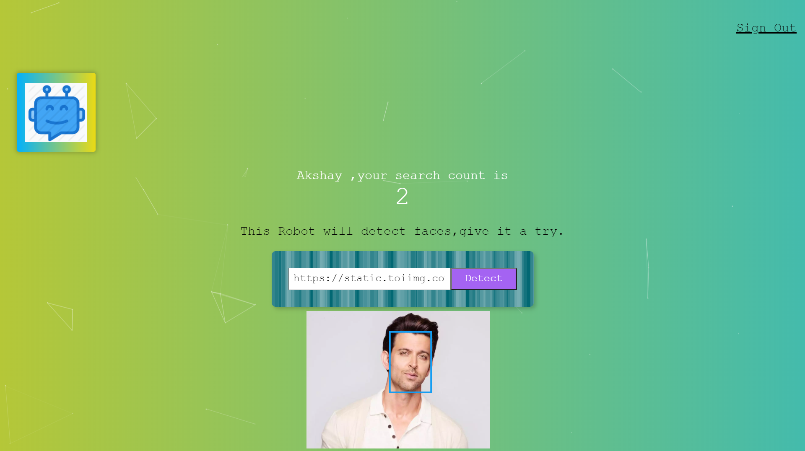

A web application that is built using React.js, node.js, and using a REST API. One can Sign in, Register, and use the application where it asks for an image link and detects the face in it and keeps track of the user's entry count.

